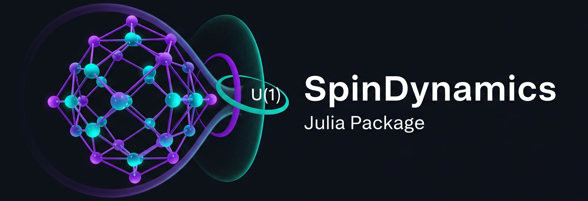

# SpinDynamics

[](https://github.com/javahedi/SpinDynamics.jl/actions/workflows/CI.yml?query=branch%3Amain)




SpinDynamics is a Julia package for simulating quantum spin systems, computing dynamical correlation functions, and analyzing spectral properties using both **full Hilbert space** and **symmetry-adapted subspaces**. The package implements **on-the-fly Hamiltonian construction**, exploiting lattice symmetries such as U(1) to reduce computational cost.

---

## Features

- **On-the-fly Hamiltonian** construction:
  - Avoids storing the full Hamiltonian explicitly.
  - Supports full Hilbert space and block-diagonal subspaces using lattice symmetries (e.g., U(1)).

- **Spectral methods**:
  - **Lanczos algorithm** for ground states, low-energy excitations, and dynamical correlations.
  - **Kernel Polynomial Method (KPM)** for high-resolution spectral functions.
  - **Chebyshev, Krylov, and Quantum Typicality-based time evolution**.

- **Observables and Spin Dynamics**:
  - Magnetization, spin-spin correlation functions, dynamic structure factors `S(q, ω)`.

- **Example scripts**:
  - Compute spectra for XXZ models.
  - Compare Lanczos and KPM results.
  - Study time evolution and magnetization dynamics.

---

## Installation

Install directly from GitHub:

```julia
using Pkg
Pkg.add(url="https://github.com/javahedi/SpinDynamics.jl")
