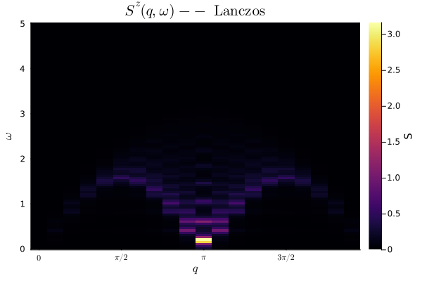
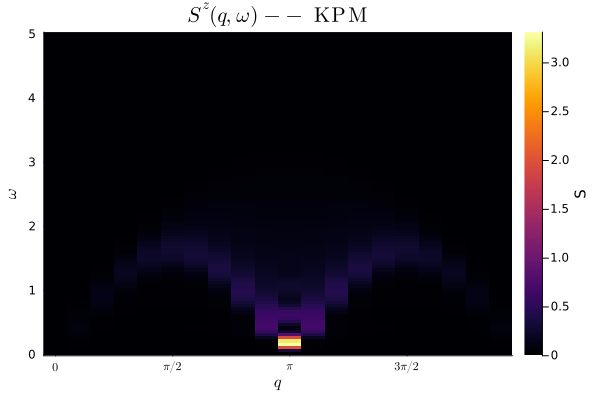
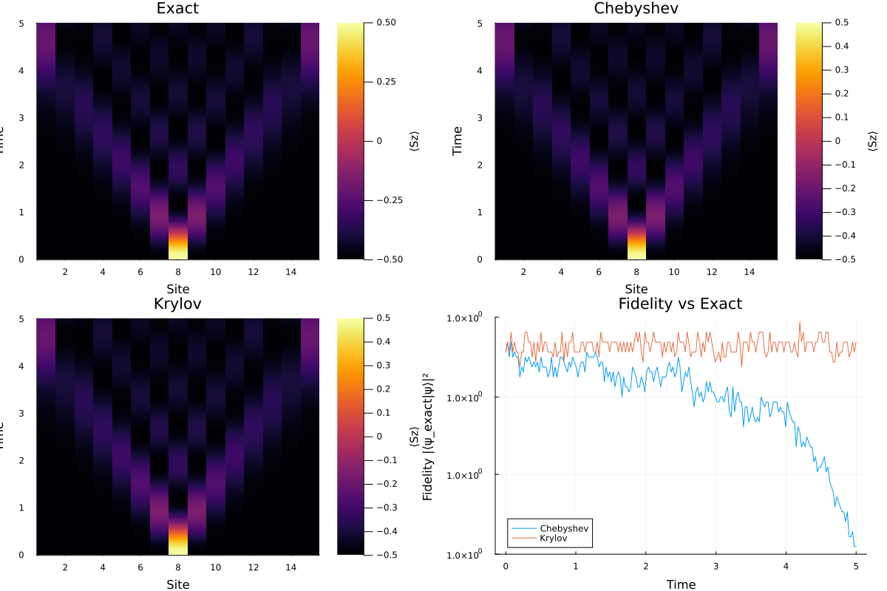

# SpinDynamics.jl

[](https://github.com/javahedi/SpinDynamics.jl/actions/workflows/CI.yml?query=branch%3Amain)

<p align="center">
  
</p>

**SpinDynamics.jl** is a Julia package for exact and Krylov-based simulations of quantum spin systems. It provides matrix-free Hamiltonian application, symmetry-reduced bases, Lanczos and Kernel Polynomial Method (KPM) spectroscopy, and Chebyshev/Krylov real-time evolution.

The package is aimed at calculations where explicitly constructing the many-body Hamiltonian is unnecessary or too expensive. SpinDynamics.jl works directly with state vectors and applies the Hamiltonian on the fly, while optionally restricting the Hilbert space to a fixed-magnetization sector.

> **Status:** SpinDynamics.jl is under active development. The API is usable, but may still change before a stable release.

## What you can do

- Build spin-1/2 models in the full Hilbert space or a fixed-`nup` / U(1) sector.
- Apply XX/XY hopping, Ising `SᶻSᶻ` interactions, local fields, and custom long-range couplings without assembling a dense Hamiltonian.
- Compute ground states and extremal eigenvalues with Lanczos iteration.
- Compute dynamical structure factors `S(q, ω)` using Lanczos or KPM.
- Evolve quantum states in real time using Chebyshev or Krylov methods.
- Measure local magnetization, connected correlations, and static structure factors.
- Construct common initial states such as Néel, domain-wall, polarized, and locally flipped states.

## Installation

SpinDynamics.jl currently targets **Julia 1.11** and can be installed directly from GitHub:

```julia
using Pkg
Pkg.add(url="https://github.com/javahedi/SpinDynamics.jl")
```

For development, clone the repository and instantiate its environment:

```bash
git clone https://github.com/javahedi/SpinDynamics.jl.git
cd SpinDynamics.jl
julia --project=. -e 'using Pkg; Pkg.instantiate()'
```

## Quick start

The following example builds an antiferromagnetic XXZ chain in the zero-magnetization sector and finds its ground state without explicitly constructing the Hamiltonian matrix.

```julia
using SpinDynamics

L = 16
Jxy = 1.0
Jz = 1.0

model = build_model(
    L;
    nup = L ÷ 2,
    hopping = nn_hopping(L, Jxy),
    zz = nn_hopping(L, Jz),
    onsite_field = zeros(L),
)

E0, ψ0 = lanczos_groundstate(apply_H!, model)

println("Hilbert-space dimension: ", length(model.states))
println("Ground-state energy: ", E0)
```

### Dynamical structure factor with Lanczos

```julia
q = collect(2π * (0:L-1) / L)
ω = collect(range(0.0, 5.0, length=100))

S = lanczos_sqw(ψ0, model, q, ω; lanc_m=100, eta=0.05)
```

The corresponding example script is [`examples/example_lanczosSqw.jl`](examples/example_lanczosSqw.jl).

## Spectral methods

SpinDynamics.jl currently provides two complementary approaches for zero-temperature dynamical spectra:

**Lanczos continued-fraction method** — useful when high spectral accuracy is required from a ground state and a moderate Krylov dimension is sufficient.

**Kernel Polynomial Method (KPM)** — expands the spectral function in Chebyshev polynomials and supports Jackson damping for smooth reconstruction.

<p align="center">
  
</p>

See:

- [`examples/example_lanczosSqw.jl`](examples/example_lanczosSqw.jl)
- [`examples/example_kpmSqw.jl`](examples/example_kpmSqw.jl)

## Real-time dynamics

Real-time evolution is available through both Chebyshev expansion and Krylov projection. The example below compares both approaches against exact evolution for a small XXZ chain.

<p align="center">
  
</p>

See [`examples/example.jl`](examples/example.jl).

## Main API

| Area | Functions |
| --- | --- |
| Basis construction | `build_full_basis`, `build_sector_basis` |
| Model construction | `build_model`, `nn_hopping`, `long_range_hopping` |
| Hamiltonian | `apply_H!`, `apply_rescaled_H!` |
| Lanczos | `lanczos_groundstate`, `lanczos_extremal`, `lanczos_tridiag`, `estimate_energy_bounds` |
| Spectroscopy | `lanczos_sqw`, `kpm_sqw`, `kpm_dynamical_correlation` |
| Time evolution | `chebyshev_time_evolve`, `krylov_time_evolve`, `krylov_time_evolve!` |
| Initial states | `neel_state`, `domain_wall_state`, `polarized_state`, `polarized_state_with_flips` |
| Observables | `magnetization_per_site`, `connected_correlations`, `structure_factor_Sq` |

## Running the examples

From the repository root:

```bash
julia --project=. examples/example_lanczosSqw.jl
julia --project=. examples/example_kpmSqw.jl
julia --project=. examples/example.jl
```

Some examples are computationally demanding. Reduce `L`, the number of frequency points, or the Krylov/KPM order when testing on a laptop.

## Running the tests

```bash
julia --project=. -e 'using Pkg; Pkg.test()'
```

The GitHub Actions workflow also runs the test suite automatically on pushes and pull requests.

## Current scope and roadmap

The package currently focuses on spin-1/2 lattice models represented in a computational basis, with optional conservation of total `Sᶻ`. Natural next steps include broader documentation, more systematic benchmarks, additional model/operator helpers, and a stabilized public API.

Contributions, bug reports, and suggestions are welcome through GitHub issues and pull requests.

## License

SpinDynamics.jl is distributed under the terms of the repository's [`LICENSE`](LICENSE) file.
